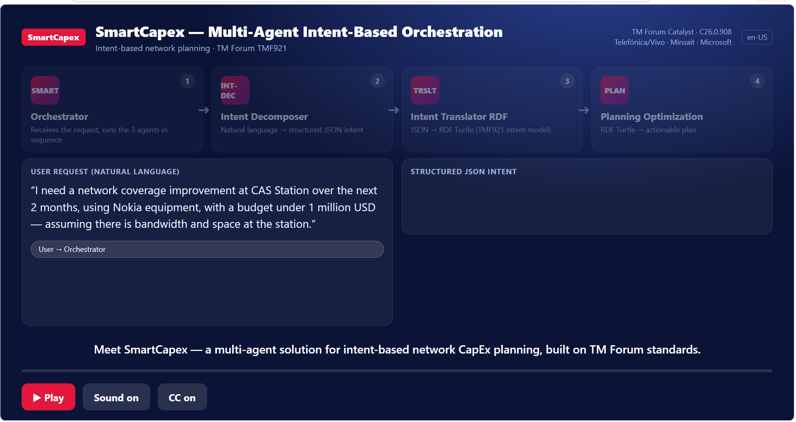
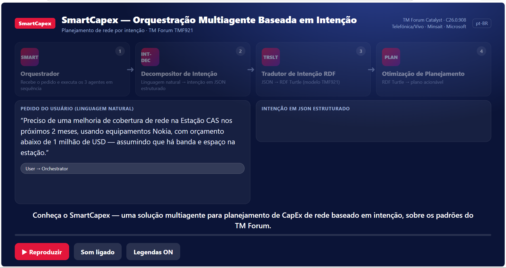
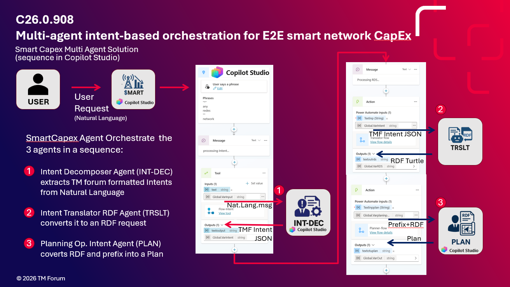

# SmartCapex — AI-Powered Multi-Agent Network CapEx Planning

> An intent-driven, standards-based multi-agent system that turns natural-language investment goals into optimized network CapEx plans — built on **Microsoft Copilot Studio** and aligned with **TM Forum TMF921 Intent Management** and the **Open Digital Architecture (ODA)**.

---

> **Disclaimer:** This is a personal project and is not affiliated with or endorsed by Microsoft.
> All examples are generic and for educational purposes only.

---

## Table of Contents

- [Overview](#overview)
- [Demo Intro Videos](#demo-intro-videos)
- [Key Value Drivers](#key-value-drivers)
- [Architecture](#architecture)
- [Agent Pipeline](#agent-pipeline)
- [TM Forum Standards Applied](#tm-forum-standards-applied)
- [Repository Structure](#repository-structure)
- [Getting Started — Copilot Studio](#getting-started--copilot-studio)
- [Usage Example](#usage-example)
- [Contributing](#contributing)
- [License](#license)

---

## Overview

SmartCapex is a production-grade AI system that addresses one of the most expensive and complex decisions in telecom operations: **where, when, and how much to invest in network infrastructure**.

The system accepts business-level investment intents in natural language, translates them into formal RDF representations using TM Forum standards, and orchestrates a set of specialized AI agents to produce ranked, constraint-aware investment recommendations.

It is designed as a **standards-based blueprint** — not a demo — that can be deployed as part of an Autonomous Network (AN) strategy aligned with TM Forum AN principles and ODA components.

The orchestration layer is built entirely on **Microsoft Copilot Studio**, using native multi-agent capabilities where the main SmartCapex agent calls three specialized sub-agents in sequence.

---

## Demo Intro Videos

Click the thumbnails below to open each intro video in the browser:

| EN-US | PT-BR |
|---|---|
| <a href="https://htmlpreview.github.io/?https://raw.githubusercontent.com/marcospredebon/TMForum-C26.0.908-SmartCapex_MultiAgentDemo/main/docs/images/SmartCapex_MultiAgent_Explainer_EN.html" target="_blank" rel="noopener noreferrer"></a> | <a href="https://htmlpreview.github.io/?https://raw.githubusercontent.com/marcospredebon/TMForum-C26.0.908-SmartCapex_MultiAgentDemo/main/docs/images/SmartCapex_MultiAgent_Explicador_PT-BR.html" target="_blank" rel="noopener noreferrer"></a> |

Note: browser autoplay policies may block audio on page load. If needed, click **Play** inside the page to start the narration.

---

## Key Value Drivers

| Dimension | Impact |
|---|---|
| CapEx savings | 10–25% reduction through AI-optimized allocation |
| OpEx reduction | Up to 15% via improved resource utilization |
| Planning cycle speed | 30–60% faster rollout and planning cycles |
| Overbuilding reduction | Eliminates misaligned investments |
| TCO improvement | Faster payback and lower total cost of ownership |

---

## Architecture

The Soultion Architecture:


The solution is organized around **five pillars**, This repo is focused in the agents pillar:

### 0. ANL as a Service
Maturity assessment and roadmap for Autonomous Network Level (ANL). Provides a production-ready ANL assessment portal aligned with TM Forum AN principles and ODA concepts.

- 66 TM Forum assets applied
- 20 ODA components mapped from planning to deployment
- One ANL-as-a-Service portal for maturity assessment

### 1. Data as a Product
Governed, reusable, AI-ready data assets following TM Forum Data-as-a-Product governance. Manages the full data lifecycle from creation to consumption, and enables analytics, AI adoption, and data monetization.

### 2. SmartCapex (AI Planning Engine)
AI/ML platform for Smart CapEx optimization. Predicts capacity demand and infrastructure needs, prioritizes investments by business value and ROI, and optimizes CapEx allocation across the network lifecycle.

### 3. Agentic — Managed by Intents (This Repo Focus)
Intent-driven multi-agent orchestration across network domains. Coordinates intelligent agents through business intents, orchestrating planning, design, deployment, and operations to enable cross-domain autonomous decision-making.

### 4. Business Value Realization
AI-driven investment decisions with measurable financial outcomes, including CapEx/OpEx savings, faster rollout, reduced overbuilding, and improved resource utilization.

### 5. Telco Standard-Driven
Intent-tuned LLM for intent-business-driven decisions. RAG engine leveraging 36 TM Forum intent assets. One Data Product Portal for governance and one Intent Copilot Portal for intent creation and validation.

---

## Agent Pipeline

The Agents Flow:




SmartCapex uses **four Microsoft Copilot Studio agents**. The main agent (**SmartCapex**) orchestrates the pipeline by calling the three sub-agents **always in sequence**:

```
User (natural language)
        │
        ▼
┌──────────────────────────────────────────┐
│           SmartCapex Agent               │  MAIN AGENT
│         (Copilot Studio)                 │  Orchestrates the full pipeline
│                                          │
│  1. Calls ──► User Intents Decomposer   │
│  2. Calls ──► Intent Translator RDF Agent             │
│  3. Calls ──► Planning/Optimization     │
└──────────────────────────────────────────┘
        │
        │  Step 1
        ▼
┌─────────────────────────┐
│  User Intents           │  SUB-AGENT 1
│  Decomposer             │  Natural language → structured JSON
└─────────┬───────────────┘
          │  { Goal, Requirements, Assumptions, Restrictions }
          │  Step 2
          ▼
┌─────────────────────────┐
│  Intent Translator RDF Agent          │  SUB-AGENT 2
│                         │  Structured JSON → RDF Turtle (TMF921/ICM)
└─────────┬───────────────┘
          │  RDF Turtle (icm:Intent + icm:hasExpectation)
          │  Step 3
          ▼
┌─────────────────────────┐
│  Planning/Optimization  │  SUB-AGENT 3
│  Agent                  │  Intent processing & investment recommendation
└─────────┬───────────────┘
          │
          ▼
   Investment Recommendation
   (ranked, with conflicts & guarantees)
```

---

### SmartCapex Agent (Main Orchestrator)

The main entry point. Users interact exclusively with this agent. It receives the natural language request and **always calls the three sub-agents in the same fixed sequence**, passing the output of each step as the input to the next.

See full instructions → [`copilot-studio/instructions/smartcapex-main.md`](copilot-studio/instructions/smartcapex-main.md)

---

### Sub-Agent 1 — User Intents Decomposer
> **Demo instructions:** [`copilot-studio/instructions/demo-intent-decomposer.txt`](copilot-studio/instructions/demo-intent-decomposer.txt)

Receives a free-text network investment request and produces a structured JSON object with four mandatory arrays:

| Field | Semantic |
|---|---|
| `Goal` | Primary business objectives |
| `Requirements` | Requested outcomes and operational priorities |
| `Assumptions` | Planning premises and forecast horizons |
| `Restrictions` | Hard limits, budget caps, exclusions |

**Example input:**
```
Based on a $500k budget and 2-year demand forecast, generate a network deployment
plan that prioritizes the most saturated sites and areas with demand but no coverage.
```

**Example output:**
```json
{
  "Goal": ["Generate a network deployment plan", "Ensure optimal service levels"],
  "Requirements": ["Prioritize most saturated existing sites", "Cover areas with demand and no coverage"],
  "Assumptions": ["Use a 2-year demand forecast"],
  "Restrictions": ["Budget limited to $500k"]
}
```

See full instructions → [`copilot-studio/instructions/user-intents-decomposer.md`](copilot-studio/instructions/user-intents-decomposer.md)

---

### Sub-Agent 2 — Intent Translator RDF Agent
> **Demo instructions:** [`copilot-studio/instructions/demo-intent-translator-rdf-rdf.txt`](copilot-studio/instructions/demo-intent-translator-rdf-rdf.txt)

Converts the structured JSON into one or more **RDF Turtle** business intents aligned with TMF921 and the TM Forum Intent Common Model (ICM / TIO v3.6.0).

Each intent is modeled as `icm:Intent` with typed expectations:

| Expectation Type | When Used |
|---|---|
| `DeliveryExpectation` | Deploy, establish, connect, provide a business outcome |
| `PropertyExpectation` | Constrain cost, quality, capacity, latency, coverage |
| `ReportingExpectation` | Require visibility, optimization evidence, KPI tracking |
| `ControlExpectation` | Hard guardrails and business rules |

See full instructions → [`copilot-studio/instructions/intent-translator-rdf.md`](copilot-studio/instructions/intent-translator-rdf.md)

---

### Sub-Agent 3 — Planning/Optimization Agent
> **Demo instructions:** [`copilot-studio/instructions/demo-planning-optimization.txt`](copilot-studio/instructions/demo-planning-optimization.txt)

Processes the RDF intent document and returns a structured JSON investment recommendation with:

- System intentions ranked by impact
- Detected conflicts (threshold, objective, scope)
- Identified gaps (missing horizon, demand, quality targets)
- Optimization focus areas
- Required guarantees

See full instructions → [`copilot-studio/instructions/planning-optimization.md`](copilot-studio/instructions/planning-optimization.md)

---

## TM Forum Standards Applied

| Standard | Version | Role in SmartCapex |
|---|---|---|
| TMF921 Intent Management | v5.0.0 | Core intent lifecycle management |
| Intent Common Model (ICM) | TIO v3.6.0 | RDF ontology for intent modeling |
| TR292A Intent Management Elements | v3.6.0 | Intent element definitions |
| TR292B Intent State Machines | v3.7.0 | Intent lifecycle state transitions |
| TR292C Function Definition Ontology | v3.6.0 | Functional ontology |
| TR290V Intent Vocabulary Reference | v3.6.0 | Common model vocabulary |
| GB1033 Functional Framework (eTOM) | v25.5 | Business process alignment |
| GB922 Information Framework (SID) | v25.5 | Data model alignment |
| ODA Open Digital Architecture | — | Component mapping (20 ODA components) |

> **RDF format:** All intents are serialized as **RDF** (Resource Description Framework) Turtle (`.ttl`) using the `icm:` and `insp:` prefixes from TM Forum ICM ontologies.

---

## Repository Structure

```
smartcapex/
├── README.md
├── docs/
│   ├── images/
│   │   └── architecture-overview.png        ← 📌 upload this file
│   ├── agents/
│   │   ├── 01-user-intents-decomposer.md
│   │   ├── 02-intent-translator-rdf.md
│   │   ├── 03-smartcapex-main-agent.md
│   │   └── 04-planning-optimization-agent.md
│   └── standards/
│       └── tmforum-references.md
├── copilot-studio/
│   ├── SETUP.md                              ← step-by-step Copilot Studio guide
│   └── instructions/
│       ├── smartcapex-main.md               ← paste into SmartCapex agent
│       ├── user-intents-decomposer.md       ← paste into Sub-Agent 1
│       ├── intent-translator-rdf.md                 ← paste into Sub-Agent 2
│       └── planning-optimization.md         ← paste into Sub-Agent 3
├── examples/
│   ├── sample-intent-request.txt
│   ├── sample-structured-intent.json
│   └── sample-rdf-intent.ttl
└── LICENSE
```

---

## Getting Started — Copilot Studio

### Prerequisites

- Microsoft Copilot Studio license (or Microsoft 365 Copilot with Copilot Studio access)
- Azure OpenAI resource (or Copilot Studio's built-in model)
- Permissions to create and publish agents in your Copilot Studio environment

### Demo Instructions — Ready to Use

The three files below are the **exact agent instructions deployed in this demo**. Copy and paste each one into the corresponding agent's **Instructions** field in Copilot Studio: 

Note:Besides instructions, additionally Copilot Studio agents uses for their Knoledge bases the TMForum references for each Agent, deppending on each agent purpose and instructions/needs.

Knowledge Base file reference by agent (files are in `docs/agents/`):

| Agent | KB File |
|---|---|
| User Intents Decomposer | [`docs/agents/kb-intent-decomposer-agent.txt`](docs/agents/kb-intent-decomposer-agent.txt) |
| Intent Translator RDF Agent | [`docs/agents/kb-Intent-Translator-RDF-Agent.txt.txt`](docs/agents/kb-Intent-Translator-RDF-Agent.txt.txt) |
| Planning/Optimization Agent | [`docs/agents/kb-planning-optimization-intent-agent.txt`](docs/agents/kb-planning-optimization-intent-agent.txt) |
| SmartCapex Main Agent (orchestrator) | Uses the three sub-agent KB files above |

| File | Agent |
|---|---|
| [`copilot-studio/instructions/demo-intent-decomposer.txt`](copilot-studio/instructions/demo-intent-decomposer.txt) | User Intents Decomposer (Sub-Agent 1) |
| [`copilot-studio/instructions/demo-intent-translator-rdf-rdf.txt`](copilot-studio/instructions/demo-intent-translator-rdf-rdf.txt) | Intent Translator RDF Agent (Sub-Agent 2) |
| [`copilot-studio/instructions/demo-planning-optimization.txt`](copilot-studio/instructions/demo-planning-optimization.txt) | Planning/Optimization Agent (Sub-Agent 3) |

### Setup

Follow the step-by-step guide in [`copilot-studio/SETUP.md`](copilot-studio/SETUP.md).

**High-level steps:**
1. Create and publish **Sub-Agent 1** — paste `demo-intent-decomposer.txt`
2. Create and publish **Sub-Agent 2** — paste `demo-intent-translator-rdf-rdf.txt`
3. Create and publish **Sub-Agent 3** — paste `demo-planning-optimization.txt`
4. Create the **SmartCapex main agent** — paste `copilot-studio/instructions/smartcapex-main.md` and connect the three sub-agents as actions
5. Test the end-to-end pipeline with the example in `examples/sample-intent-request.txt`

---

## Usage Example

Send a message to the SmartCapex agent:

```
Based on a $2M budget and a 3-year demand forecast, generate a network
transport deployment plan for the metropolitan region, prioritizing
the most overloaded corridors and areas with growing demand but no
current infrastructure. Availability must be ≥ 99.95%.
```

SmartCapex will internally:
1. Decompose the request → `{ Goal, Requirements, Assumptions, Restrictions }`
2. Translate it to RDF Turtle (TMF921/ICM)
3. Route to the Planning/Optimization agent
4. Return a ranked investment recommendation with conflicts, gaps, and guarantees

---

## Contributing

Pull requests are welcome. For major changes, please open an issue first.

Please ensure:
- No credentials, API keys, or internal IDs are committed
- All intent examples use generic geographic references (e.g. `City-A`, `Region-X`)
- RDF serialization uses correct `icm:` / `insp:` prefixes (format: **RDF** Turtle, not RDS)
- Agent instructions follow the output contracts defined in `docs/agents/`

---

## License

This is a personal project and is not affiliated with or endorsed by Microsoft.
All examples are generic and for educational purposes only. 

This project is licensed under the [MIT License](LICENSE).
